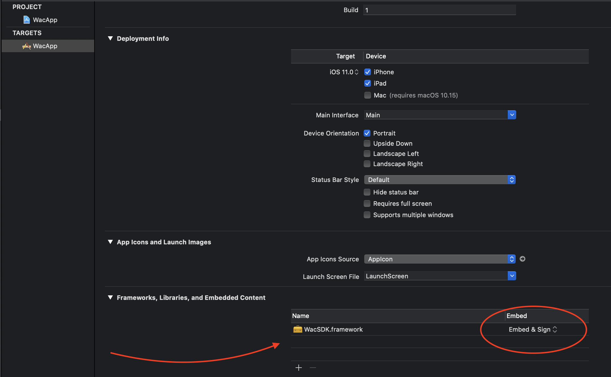
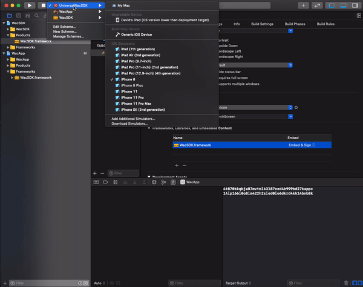
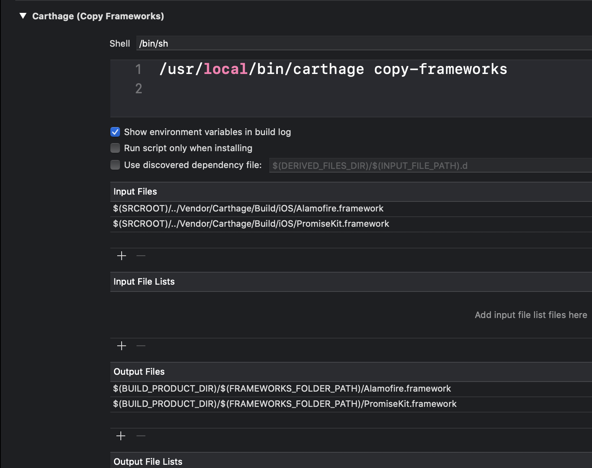

# WAC
This :iphone: ios library uses carthage.

Install carthage with your favourite package manager:

https://github.com/Carthage/Carthage#installing-carthage

Open Xcode > WACWorkspace.xcworkspace

Available Schemes:

- :hammer: UniversalWACSDK 
  - It compiles and creates a fat SDK library using DEBUG and RELEASE variants for all architectures (real device arm, simulator x86, ..). :warning: Do not use this for App Store releases.
  - Creates the `WacSDK.framework` under products folder
  - Copy the `WacSDK.framework` to your swift app under `Frameworks` as Embedded
 
  

    
  

Gif showing the steps:

    
  

  

  - Make sure your `Frameworks Search Paths` point to the location of the framework.
  - WAC SDK has a dependency on 2 frameworks: AlamoFire and PromiseKit. These dependencies are linked to inside of the WAC Framework to avoid symbol collisions if your project uses them. To avoid a linker error at compile time, your App will need to embed them somehow. This is where Carthage comes to the rescue: Use `Carthage copy-frameworks` functionality, specifying the location where your Carthage builds are (i.e. `$(SRCROOT)/../Cartahge/Build/iOS/Alamofire.framework`) and the path where to copy to (i.e. `$(BUILD_PRODUCT_DIR)/$(FRAMEWORKS_FOLDER_PATH)/Alamofire.framework`)
  
  

    
  

 
- :crystal_ball: WacApp - Demo app that shows hot to use the APIs.
- :lock_with_ink_pen: WacSDK - Builds the Framework based on architecture. App Store would only need device (RELEASE) configuration.

  

